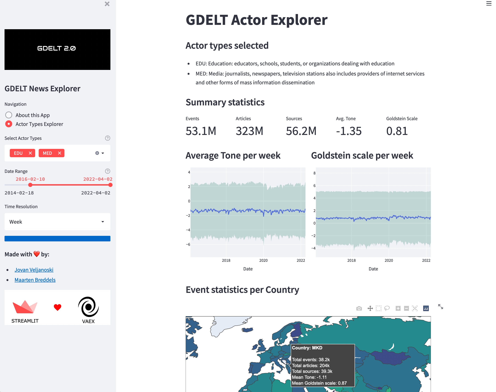

# streamlit-600million-gdelt-news-articles

Explore the impact of over 600 million news articles gathered by the [GDLET](https://blog.gdeltproject.org/gdelt-2-0-our-global-world-in-realtime/) project.

Available at https://streamlit.vaex.io/



# Running this app

Clone the repo
```
$ git clone https://github.com/vaexio/streamlit-600million-gdelt-news-articles.git
```

Install the requirements:
```
pip install -r requirements.txt
```

Run the app:
```
$ streamlit run app.py
```

We run our app like:
```
$ VAEX_CACHE="memory,disk" streamlit run app.py --server.port=8601 --server.headless=True
```

The data is publicly available on Google BigQuery and GDLET's own FTP servers.
